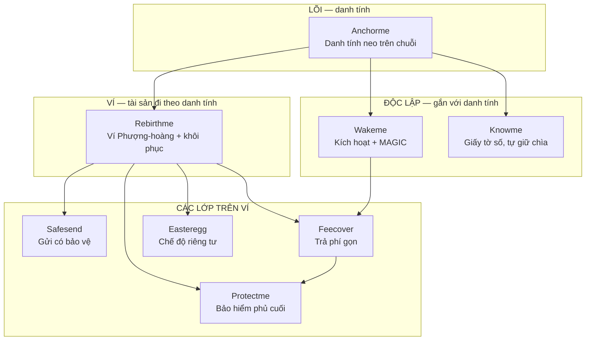
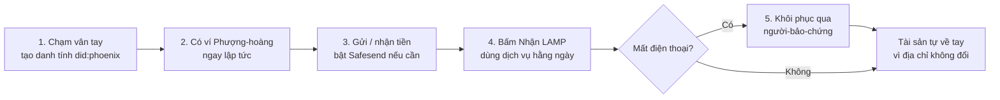
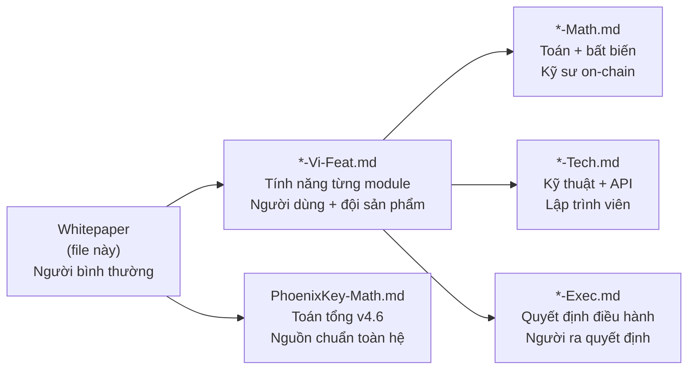
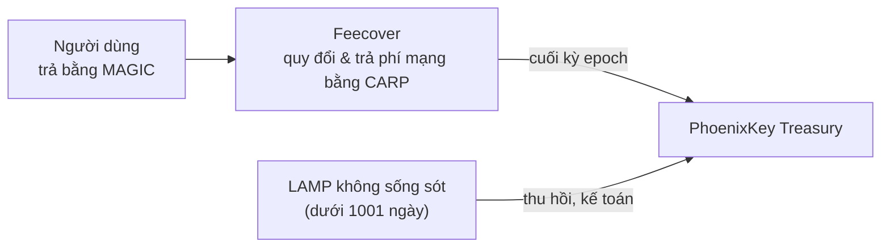

# PhoenixKey — Whitepaper

> **Tài liệu này viết cho ai:** bất kỳ ai muốn hiểu PhoenixKey là gì trong 10 phút — không cần biết crypto, không cần biết lập trình.
> **Ngày:** 2026-07-09.

---

## 0. Tóm tắt 1 phút

- **PhoenixKey = một chiếc ví trên điện thoại mở bằng vân tay** — không cần nhớ mật khẩu, không cần chép 24 từ ra giấy.
- **Mất điện thoại vẫn lấy lại được tài sản** — nhờ người thân bạn tin tưởng xác nhận hộ, không ai giữ tiền thay bạn.
- **Dùng dịch vụ chỉ cần biết một con số phí** — không phải hiểu tỷ giá, không phải giữ "xăng" mạng.

Đọc tiếp bên dưới để hiểu từng phần. Nếu bạn là dev/nhà đầu tư/người làm toán, các đường dẫn kỹ thuật nằm ở mục 5 và mục 6.

---

## 1. Vấn đề — và tầm nhìn PhoenixKey

Hôm nay, danh tính số và tài sản số của bạn có ba chỗ vướng lớn:

1. **Danh tính không thật sự của bạn.** Tài khoản Google/Facebook do công ty giữ — họ khoá là bạn mất quyền. Ví crypto thì dựa vào một cụm **24 từ giấy** — chép nhầm một từ, cháy nhà mất tờ giấy, hay lộ giấy cho kẻ xấu là **mất trắng vĩnh viễn**, không có "quên mật khẩu, bấm khôi phục". **(Đây là mô tả ví truyền thống — với PhoenixKey thì KHÔNG như vậy, xem cách khôi phục ở mục 3.)**
2. **Khôi phục khi mất máy gần như không thể.** Ví truyền thống không phân biệt được "bạn" với "chiếc chìa khoá" — mất chìa là mất người.
3. **Phí và trải nghiệm quá phức tạp cho người bình thường.** Phải tự giữ ADA làm "xăng", tự hiểu tỷ giá, tự tính đủ số dư chưa — trước khi làm được việc đơn giản nhất.

**PhoenixKey giải quyết cả ba bằng một ý tưởng gốc: danh tính của bạn sinh ra từ chính vân tay bạn, khoá trong con chip bảo mật sẵn có trong điện thoại** — giống hệt cách Face ID / vân tay đang mở khoá máy bạn mỗi ngày, không phải một tờ giấy có thể mất.

Từ danh tính này, một chiếc ví tự động được tạo ra và đi theo bạn suốt đời.

Mất điện thoại? Đổi máy mới, xác thực lại bằng vân tay, ví và tiền vẫn còn nguyên — **không cần nhớ 24 từ nào cả**.

Mọi lớp phía trên — gửi tiền an toàn, kích hoạt dịch vụ, trả phí gọn, bảo hiểm, giấy tờ số, quyền riêng tư — đều xây trên nền danh tính đó.

**PhoenixKey kiếm tiền từ đâu?** Không bán dữ liệu, không thu phí ẩn. Nguồn thu đến từ lớp trả phí Feecover (chênh lệch quy đổi khi hệ thống trả phí mạng hộ bạn) và phần vốn mồi LAMP không được kích hoạt hết sẽ về Treasury chung (kế toán minh bạch, không đốt bỏ). Chi tiết ở mục 6.

> **Dành cho ai tò mò sâu hơn:** mục tiêu dài hạn của PhoenixKey là một **Open SDK cho mọi đội xây dựng trên Cardano** — không chỉ một ứng dụng, mà một lớp hạ tầng danh tính + tài sản mà ai cũng cắm vào dùng lại được, giống vai trò Stripe cho thanh toán hay Auth0 cho đăng nhập, nhưng có sẵn ví + khôi phục bằng sinh trắc. Chuẩn kỹ thuật `did:phoenix` đã đăng ký chính thức trong danh bạ DID Method của W3C. Đường dẫn kỹ thuật đầy đủ ở mục 6.

---

## 1.5. Trước khi xem sơ đồ — vài từ khoá cần nhớ

Ngay dưới đây là một sơ đồ 8 module với tên tiếng Anh. Trước khi nhìn nó, chỉ cần nắm 4 hình ảnh đời thường này là đủ:

- **Vân tay = chìa khoá.** Con chip bảo mật trong điện thoại giữ chìa, không tờ giấy nào giữ.
- **Ví Phượng-hoàng = cái ví.** Nó gắn với danh tính bạn, không gắn với chiếc điện thoại — nên mất máy vẫn còn ví.
- **Người-bảo-chứng = người thân giữ hộ chìa dự phòng.** Họ giúp bạn khôi phục khi mất máy, nhưng KHÔNG bao giờ giữ tiền của bạn.
- **LAMP / MAGIC = tiền nạp ban đầu và tiền tiêu hằng ngày.** Giống một gói khởi tạo (LAMP) mỗi ngày sinh ra một ít tiền tiêu dịch vụ (MAGIC).

### Từ điển nhanh (tra ngược khi gặp lại)

| Thuật ngữ | Nghĩa đời thường |
|---|---|
| `did:phoenix` | "Số CMND số" của bạn, neo trên chuỗi Cardano |
| Secure Enclave | Con chip khoá vân tay có sẵn trong điện thoại |
| Người-bảo-chứng | Người thân/bạn bè giữ hộ một phần quyền khôi phục — không giữ tiền bạn |
| LAMP | Khoản "vốn mồi" được cấp lúc mới bắt đầu |
| MAGIC | Tiền tiêu dùng hằng ngày, sinh ra dần từ LAMP |
| CARP | Đơn vị trả phí mạng phía sau — bạn không cần nhìn thấy |

---

## 2. Sơ đồ tổng quan — 8 module, quan hệ giữa chúng

**Một câu trước sơ đồ:** PhoenixKey có **1 lõi** (danh tính) + **1 ví** + **6 lớp tiện ích** mọc lên từ đó.

**Đọc sơ đồ:** **Anchorme** là gốc — mọi thứ khác đều cần một danh tính đã neo trước. **Rebirthme** là chiếc ví gắn trực tiếp vào danh tính đó. Từ ví, các lớp mọc lên: **Safesend** (gửi an toàn hơn), **Easteregg** (ẩn danh có kiểm soát), **Feecover** (trả phí gọn), và **Protectme** (lớp bảo hiểm phủ phần rủi ro còn sót — phủ cả tài sản trong ví Rebirthme lẫn sự cố liên quan phí Feecover). Song song, **Wakeme** (kích hoạt nhận LAMP) và **Knowme** (giấy tờ số) đều gắn thẳng vào danh tính, không phụ thuộc ví.

> Tên viết tắt trong sơ đồ — A (Anchorme), R (Rebirthme), S (Safesend), F (Feecover), P (Protectme), E (Easteregg), W (Wakeme), K (Knowme) — tương ứng đúng 8 mục ở phần 4 bên dưới.
>
> **Trạng thái hôm nay:** cạnh Anchorme → Wakeme (kích hoạt nhận LAMP cho danh tính Cá nhân) hiện đang chờ một lớp bảo mật của Anchorme được xây nốt — xem [PhoenixKey-STATUS.md](./PhoenixKey-STATUS.md).

---

## 3. Sơ đồ hành trình người dùng

**Đọc sơ đồ:** một vòng đời điển hình — tạo danh tính bằng vân tay, có ví ngay, dùng ví (gửi/nhận, kích hoạt dịch vụ), và nếu chẳng may mất máy thì khôi phục qua người-bảo-chứng mà **không mất tài sản, không cần nhớ 24 từ**.

> **Trạng thái hôm nay:** bước 1–3 (tạo danh tính, có ví, gửi/nhận) đã chạy trên validator (173/173 test PASS); bước 4 (Nhận LAMP) và phần bảo vệ chống rút-sạch trong bước 5 (khôi phục khi khoá đã lộ) đang trong lộ trình xây — xem chi tiết tại [PhoenixKey-STATUS.md](./PhoenixKey-STATUS.md).

### Điều kiện để khôi phục hoạt động

Khôi phục qua người-bảo-chứng chỉ chạy được nếu bạn đã **chỉ định người-bảo-chứng TRƯỚC khi mất máy**. Vì vậy: ngay sau khi tạo ví, hãy chọn người thân/bạn bè tin tưởng làm người-bảo-chứng.

- Số người-bảo-chứng tối thiểu và ngưỡng xác nhận (kiểu "M trong N người đồng ý"): *[CẦN CHỐT con số cuối cùng — xem [Rebirthme](./PhoenixKey-Rebirthme-Vi-Feat.md)]*.
- Thời gian khôi phục có một khoảng chờ an toàn (timelock) trước khi hoàn tất, để chặn kẻ xấu chiếm đoạt nhanh.
- **Nếu bạn CHƯA từng chỉ định người-bảo-chứng nào**, hãy làm ngay bây giờ — hướng dẫn tại [Rebirthme](./PhoenixKey-Rebirthme-Vi-Feat.md).

### Mất máy / nghi bị lộ khoá — làm gì NGAY

1. Mở app trên một máy khác, bấm **Đóng-băng khẩn cấp** để chặn chi từ ví.
2. Báo cho những người-bảo-chứng của bạn để họ chuẩn bị xác nhận khôi phục.
3. Theo dõi trạng thái khôi phục trong app.
4. Nếu đã có tổn thất, nộp yêu cầu bồi hoàn qua [Protectme](./PhoenixKey-Protectme-Vi-Feat.md).

---

## 4. Tám module — mỗi cái là gì, giải quyết gì

> **Ghi chú đọc:** các mô tả dưới đây là **thiết kế đích** (kim chỉ nam). Một số cơ chế an toàn cốt lõi — van chống rút-sạch của Rebirthme, hòm ký-quỹ của Safesend, cổng chi-trả của Protectme — đang trong giai đoạn xây. Xem trạng thái thật hôm nay ở [PhoenixKey-STATUS.md](./PhoenixKey-STATUS.md) trước khi coi bất kỳ danh tính nào là an toàn cho giá-trị lớn.

### Anchorme — Danh tính của bạn, neo thẳng trên chuỗi
**Là gì:** "chứng minh thư số" của bạn, một `did:phoenix:...` neo trên Cardano mà chỉ vân tay + con chip an toàn của điện thoại mới điều khiển được (\*) — không ai cấp phát, không ai thu hồi.
Nó giải quyết việc danh tính hôm nay phụ thuộc một công ty, và mật khẩu/giấy 24-từ có thể mất/lộ. Bạn tạo danh tính bằng vân tay, dùng nó để đăng nhập/ký khắp hệ sinh thái, và khi đổi máy chỉ cần xác thực lại bằng vân tay trên máy mới (gọi nội bộ là "xoay chìa") — số danh tính (`did:phoenix`) không đổi, giống như bạn đổi điện thoại mới nhưng số CCCD ngoài đời vẫn giữ nguyên; mọi quan hệ đã neo giữ nguyên.

> (\*) Với danh tính **Tổ chức / Dịch vụ**, tính chất này đã đủ vì con dấu luôn đòi chữ ký của "cha" khi đúc. Với danh tính **Cá nhân**, một lớp tính-độc-nhất trên chuỗi đang được xây (đóng một lỗ hiếm gặp: mạo danh trùng tên khi đúc danh tính) — xem tiến độ ở [PhoenixKey-STATUS.md](./PhoenixKey-STATUS.md). Trước khi lớp đó xong, chỉ nên dùng danh tính Cá nhân cho việc không giữ giá-trị lớn.

Xem sau: [Tính năng chi tiết](./PhoenixKey-Anchorme-Vi-Feat.md) · Toán/bất biến: [PhoenixKey-Anchorme-Math.md](./PhoenixKey-Anchorme-Math.md)

### Rebirthme — Chiếc ví đi theo bạn, không đi theo chìa khoá
**Là gì:** ví mà tài sản gắn với DANH TÍNH của bạn, không gắn với chìa khoá — địa chỉ ví bất biến suốt đời, mất máy vẫn khôi phục xong tiêu tiếp.
Nó giải quyết ba chỗ đau chí mạng của ví crypto truyền thống: mất seed là mất sạch vĩnh viễn, lộ seed là mất sạch tức thì, và đổi khoá thường làm chết luôn địa chỉ cũ. Rebirthme lật ngược cả ba:

- **Khôi phục qua người-bảo-chứng** (họ KHÔNG giữ mảnh bí mật của bạn) và **địa chỉ không đổi dù bạn xoay khoá bao nhiêu lần** — hai điểm này đã có trên validator (173/173 test PASS).
- **Một "van" chống rút-sạch khi khoá lộ** — đây là hạng mục ưu tiên cao nhất đang xây (xem [PhoenixKey-STATUS.md](./PhoenixKey-STATUS.md)). *Ví dụ:* nếu chìa khoá của bạn chẳng may bị lộ và có kẻ cố rút sạch trong một lần, "van" này giống cầu dao tự động ngắt khi phát hiện dòng điện bất thường — nó tự động chặn hoặc làm chậm giao dịch bất thường, cho bạn kịp thời gian phản ứng, thay vì mất hết trong một cú bấm. Tới khi van này xong, với ví giữ giá-trị lớn hãy bật **Đóng-băng ngay khi nghi lộ khoá**.

Xem sau: [Tính năng chi tiết](./PhoenixKey-Rebirthme-Vi-Feat.md) · Toán/bất biến: [PhoenixKey-Rebirthme-Math.md](./PhoenixKey-Rebirthme-Math.md) (§4.B anti-drain, Định lý T-WALLET-3 — trần thiệt hại CÓ ĐIỀU KIỆN van anti-drain phải bật)

### Safesend — Gửi có bảo vệ, nút "hoàn tác" cho giao dịch
**Là gì:** cách gửi tiền có một cửa-sổ để huỷ — khoản gửi khoá tạm trong hòm ký-quỹ, đổi ý thì huỷ và tiền hoàn về, khoản lớn thì người nhận phải bấm đồng ý mới nhận được.
Nó giải quyết việc chuyển tiền crypto bình thường là bất khả đảo tuyệt đối — gửi nhầm một ký tự là mất trắng, không có "gọi ngân hàng chặn lệnh".

Ngưỡng "khoản lớn" và độ dài cửa-sổ huỷ *[CẦN CHỐT — chỉnh được trong cài đặt]*.

> **Lưu ý:** Safesend là **tuỳ chọn (opt-in)** — nếu bạn KHÔNG bật, giao dịch gửi đi vẫn tức thời và **KHÔNG thể hoàn tác**, giống ví thường. Hãy bật Safesend cho khoản tiền bạn thấy rủi ro; khoản nhỏ đời thường có thể gửi thường cho nhanh.

Cơ chế này đã có đặc tả toán học đầy đủ và đang trong giai đoạn xây code — theo dõi tiến độ ở [PhoenixKey-STATUS.md](./PhoenixKey-STATUS.md).
Xem sau: [Tính năng chi tiết](./PhoenixKey-Safesend-Vi-Feat.md) · Toán/bất biến: [PhoenixKey-Safesend-Math.md](./PhoenixKey-Safesend-Math.md) (bất biến SS-1..12, Định lý No-loss)

### Wakeme — Chiếc Đèn và Điều ước của bạn
**Là gì:** bước "thắp đèn" — bạn tạo ví bằng vân tay, bấm một nút, nhận một túi LAMP vào ví mình; túi đó mỗi ngày sinh ra MAGIC ("điều ước") để bạn dùng dịch vụ, và dùng đều đặn đủ lâu thì phần LAMP sống sót thật sự thành của bạn.
Nó giải quyết việc trước đây phải nạp 200.000đ mới bắt đầu được — giờ miễn phí khởi tạo, không cần hiểu tỷ giá, hệ thống tự lo phí mạng.

Nói dễ hiểu: túi LAMP giống một **gói dùng-thử có điều kiện**. Nếu bạn dùng dịch vụ đều đặn trong **1001 ngày** (khoảng 2 năm rưỡi), gói đó chính thức thành tài sản của bạn — rút/bán được. Nếu bỏ dùng giữa chừng, phần chưa hết hạn sẽ được thu hồi lại, giống thẻ tích điểm hết hạn nếu không dùng. (LAMP là "vốn mồi"; MAGIC là tiền tiêu hằng ngày sinh ra từ nó — xem Từ điển nhanh ở mục 1.5.)

Xem sau: [Tính năng chi tiết](./PhoenixKey-Wakeme-Vi-Feat.md) · Toán/bất biến: [PhoenixKey-Wakeme-Math.md](./PhoenixKey-Wakeme-Math.md)

### Feecover — Lớp trả phí gọn
**Là gì:** lớp giúp bạn chỉ cần biết một loại đơn vị duy nhất (MAGIC) khi dùng dịch vụ — hệ thống tự lo phí mạng, phí lưu trữ, mọi thứ phía sau.
Nó giải quyết việc bình thường muốn dùng dịch vụ blockchain phải tự giữ ADA, tự hiểu tỷ giá, tự tính đủ tiền chưa. Với Feecover, bạn chỉ nhìn một con số phí cố định theo sức mua, không trôi theo giá thị trường; hệ thống tự quy đổi và thanh toán bằng CARP đằng sau.

Ba "đơn vị" trong hệ, nhìn một bảng cho gọn:

| Đơn vị | Bạn thấy khi nào | Vai trò |
|---|---|---|
| **LAMP** | Lúc mới kích hoạt (Wakeme) | Vốn mồi ban đầu |
| **MAGIC** | Hằng ngày khi dùng dịch vụ | Tiền tiêu dùng bạn nhìn thấy |
| **CARP** | Không hiện ra | Tiền trả phí mạng phía sau, hệ thống tự lo |

Xem sau: [Tính năng chi tiết](./PhoenixKey-Feecover-Vi-Feat.md) · Toán/bất biến: [PhoenixKey-Feecover-Math.md](./PhoenixKey-Feecover-Math.md)

### Protectme — Lớp bồi hoàn cuối, phủ phần bị mất
**Là gì:** lớp bảo vệ dạng bảo hiểm — khi tài sản bị đánh cắp thật, Protectme bồi hoàn phần còn thiếu, sau khi ví đã tự cứu lại được nhiều nhất có thể.
Nó giải quyết cái khe hở còn sót lại sau mọi lớp an toàn tự động: nếu kẻ trộm kịp rút một phần trước khi bạn kịp khoá khẩn cấp, phần đó thực sự đã mất. Protectme phân biệt rõ hai loại:

- **Lỗi do hệ thống** (ví dụ trục trặc từ chính nền tảng): phủ mạnh.
- **Sơ suất người dùng** (ví dụ tự nguyện gửi sai địa chỉ, hoặc ký một giao dịch lừa đảo sau khi đã có cảnh báo rõ ràng): phủ có giới hạn, bạn chịu một phần.

Mỗi lần bồi hoàn có một **mức trần theo sự-cố** (incident cap) để giữ quỹ bền vững cho mọi người dùng; không đền trùng phần ví đã tự cứu được. Tiêu chí phân loại lỗi-hệ-thống-vs-sơ-suất và các mức cụ thể đang được đội chốt — xem [PhoenixKey-STATUS.md](./PhoenixKey-STATUS.md).
Xem sau: [Tính năng chi tiết](./PhoenixKey-Protectme-Vi-Feat.md) · Toán/bất biến: [PhoenixKey-Protectme-Math.md](./PhoenixKey-Protectme-Math.md) (I-PROT-INCIDENT-CAP, quyết-định treo PROT-4/PROT-10/PROT-11)

### Knowme — Kho giấy tờ của bạn, bạn giữ chìa
**Là gì:** kho danh tính tự chủ — bạn tự khai giấy tờ (họ tên, CCCD, mã số thuế...), và khi ai đó hỏi thì chỉ đưa đúng trường họ cần, phần còn lại vẫn khoá kín.
Nó giải quyết việc KYC tập trung truyền thống bắt bạn nộp trọn bộ hồ sơ cho mỗi nơi, tạo ra nhiều kho dữ liệu dễ rò rỉ. Với Knowme, dữ liệu nằm ở máy bạn, chìa khoá trong tay bạn — tiết lộ chọn lọc từng trường, tái dùng một hồ sơ ở nhiều nơi mà không phải xin lại giấy tờ.
Xem sau: [Tính năng chi tiết](./PhoenixKey-Knowme-Vi-Feat.md) · Toán/bất biến: [PhoenixKey-Knowme-Math.md](./PhoenixKey-Knowme-Math.md)

### Easteregg — Lớp trải nghiệm / quyền riêng tư mở rộng
**Là gì:** các chế độ riêng tư ẩn danh mà ví Phượng-hoàng của bạn có thể mang — số dư được che khỏi con mắt tò mò trên chuỗi, nhưng tài sản vẫn thuộc về cùng một ví và tự đi theo bạn khi khôi phục danh tính.
Cơ chế che số dư giống như đưa cho ngân hàng một tờ giấy chứng nhận "tôi đủ tiền để thanh toán" đã có công chứng, mà không cần đưa luôn sổ tiết kiệm ra cho họ xem số dư thật — hệ thống vẫn xác nhận được giao dịch hợp lệ mà không ai nhìn thấy số tiền thật.
Nó giải quyết việc mọi thứ trên Cardano đều công khai — ai mở explorer cũng thấy số dư, nguồn thu, dòng tiền của bạn. Với doanh nghiệp đây là rò rỉ bí mật kinh doanh thật sự. Easteregg không phải một ví khác, mà là chế độ riêng tư của chính ví Phoenix bạn đang dùng.
Xem sau: [Tính năng chi tiết](./PhoenixKey-Easteregg-Vi-Feat.md) · Toán/bất biến: [PhoenixKey-Easteregg-Math.md](./PhoenixKey-Easteregg-Math.md)

> **Bạn là dev / kỹ sư tích hợp** và muốn biết code nằm ở kho nào, quy trình build/test ra sao — xem [README.md](./README.md) mục 1 (bảng "Bắt đầu từ đâu") trước khi vào từng `*-Tech.md`.

---

## 5. Đọc sâu thế nào — kiến trúc tài liệu phân tầng

*Mục này dành cho người muốn đọc sâu hơn — nếu bạn chỉ cần hiểu PhoenixKey là gì, có thể bỏ qua và đọc thẳng mục 6.*

PhoenixKey viết tài liệu theo 4 tầng, mỗi tầng nhắm đúng một đối tượng đọc:

- **Bạn là người dùng bình thường, không biết crypto** — đọc xong Whitepaper này là hiểu toàn bộ hệ. Muốn biết sâu hơn về một tính năng cụ thể (ví dụ "khôi phục khi mất máy hoạt động sao"), bấm link tới file `*-Vi-Feat.md` của module đó ở mục 4.
- **Bạn là đội sản phẩm / muốn hiểu trải nghiệm chi tiết** — đọc thẳng các file `*-Vi-Feat.md`: mỗi file có hành trình bấm-nút-thấy-gì, bảng cải tiến so với cách làm cũ, câu hỏi thường gặp, và quyền lợi/nghĩa vụ của bạn.
- **Bạn là kỹ sư on-chain / người làm toán** — trong mỗi file Feat đều có link tới `*-Math.md` (đặc tả toán, bất biến, ký hiệu hình thức) và `*-Tech.md` (kiến trúc kỹ thuật, API, redeemer, datum). Trước khi vào từng `*-Math.md` module, đọc [PhoenixKey-Math.md](./PhoenixKey-Math.md) — đặc tả toán TỔNG (v4.6), nguồn chuẩn cho phân cấp khoá, TAAD anchor, danh mục loại DID mà mọi `*-Math.md` module đều tham chiếu.
- **Bạn là người ra quyết định / điều hành dự án** — mỗi module có `*-Exec.md` ghi lại các quyết định đã chốt, đang chờ, và lý do trên 4 trục (định hướng dài hạn, first-principles, tối ưu hoá, lợi ích người dùng).

Nói ngắn: **Whitepaper → Feat → (Math / Tech / Exec)** — càng đi sâu càng chuyên môn hơn, nhưng không ai bị bắt đọc phần không cần.

> **Bản đồ toàn bộ 36 tài liệu đặc tả + thứ tự nên đọc theo vai trò của bạn:** [README.md](./README.md).

---

## 5b. Ranh giới hiện tại — cái gì đã chạy, cái gì đang xây

PhoenixKey là kim chỉ nam thiết kế đích. Hôm nay: khung danh tính + ví đã chạy trên validator (173/173 test PASS), nhưng danh tính **Cá nhân** (khác Tổ chức/Dịch vụ) và lớp **chống-rút-sạch** của ví đang trong giai đoạn đóng nốt — đây là hai hạng mục bảo mật ưu tiên cao nhất. Xem tiến độ theo từng module tại [PhoenixKey-STATUS.md](./PhoenixKey-STATUS.md).

---

## 6. Vì sao PhoenixKey đáng chờ đợi

Cardano có nền tảng kỹ thuật vững nhưng thiếu một lớp danh tính + tài sản mà người dùng bình thường tin tưởng được ngay từ lần chạm đầu tiên — không cụm từ 24 chữ, không sợ mất trắng khi mất máy, không phải hiểu tỷ giá hay giữ "xăng" mạng. PhoenixKey xây đúng lớp đó, và làm nó thành **hạ tầng mở** — bất kỳ đội nào trên Cardano cũng dùng lại được, không phải dựng lại từ đầu.

PhoenixKey **không cạnh tranh với ví hay app cụ thể** — đây là lớp hạ tầng danh tính mọi đội Cardano cắm vào dùng, giống vai trò Stripe cho thanh toán hay Auth0 cho đăng nhập, nhưng có sẵn ví + khôi phục bằng sinh trắc.

### 6.1. Vì sao PhoenixKey, không phải tự xây hay dùng DID method khác

| Tiêu chí | PhoenixKey | Tự build in-house | DID method khác trên Cardano |
|---|---|---|---|
| Thời gian triển khai | SDK dùng ngay | Nhiều tháng + đội kỹ sư riêng | Tuỳ, thường thuần DID |
| Khoá sinh trắc Secure Enclave sẵn | Có | Phải tự làm | Thường không |
| Ví liền mạch + khôi phục (Rebirthme) | Có | Phải tự làm | Thường chỉ DID thuần |
| Chuẩn hoá | `did:phoenix` đã đăng ký W3C | Tự định nghĩa | Tuỳ |

Kết luận: tự làm mất nhiều tháng và một đội kỹ sư; PhoenixKey là SDK cắm-vào-dùng, đã đăng ký trong danh bạ DID Method của W3C.

### 6.2. Mô hình kinh doanh & dòng giá trị

Nguồn thu: **phí Feecover** (chênh lệch quy đổi khi hệ thống trả phí mạng bằng CARP hộ người dùng) + phần **LAMP không được kích hoạt hết** chuyển về Treasury (kế toán, KHÔNG đốt bỏ). Mô hình phí license SDK cho đội thứ ba đang thiết kế — xem [PhoenixKey-STATUS.md](./PhoenixKey-STATUS.md).

> LAMP = vốn ban đầu (cố định 36 tỷ, không lạm phát) · MAGIC = đơn vị tính phí dịch vụ · CARP = đồng thực trả phí mạng.

### 6.3. Quản trị & vận hành

- **LAMP cố định 36 tỷ, không lạm phát.** Giảm lưu hành = chuyển vào Treasury (kế toán minh bạch trên chuỗi), không đốt bỏ.
- **Quản trị không theo số token nắm giữ.** Quyền biểu quyết gắn với từng cá nhân (qua danh tính PhoenixKey), không phải theo lượng token — khác biệt lớn với các mô hình DAO token-weighted khác trên Cardano.

### 6.4. Tiến độ & bước tiếp theo

Dự án đang ở giai đoạn testnet (Preview), có audit nội bộ (red-team) chạy per-module. Trạng thái thật từng module — cái gì đã production-ready, cái gì còn chặn bởi blocker nào — cập nhật riêng, không trộn vào tài liệu định vị này.

Đây là kim chỉ nam thiết kế, không phải báo cáo tiến độ.
- Hiện trạng thật hôm nay: [PhoenixKey-STATUS.md](./PhoenixKey-STATUS.md)
- Chuẩn kỹ thuật `did:phoenix` đã đăng ký với W3C: [PhoenixKey-DIDMethod-W3C.md](./PhoenixKey-DIDMethod-W3C.md)
- Bản đồ 36 tài liệu + thứ tự đọc theo vai trò của bạn: [README.md](./README.md)
